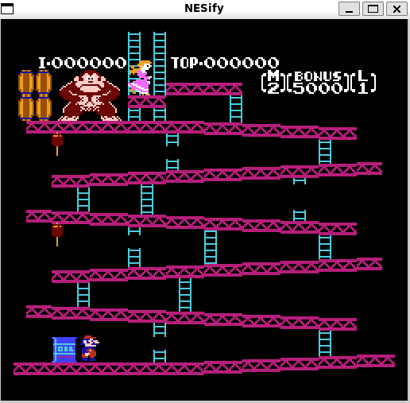
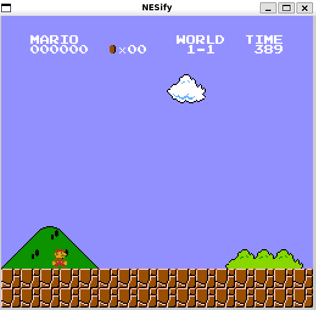

# NESify

NESify is a barebones Nintendo Entertainment System emulator written in Go. Developed for fun, likely has numerous bugs.

## Features

- NES instructions
- Rendering + Horizontal Scrolling
- NROM mapper

## Screenshots

## Dependencies

- `go 1.17`
- `github.com/akamensky/argparse`
- `github.com/sqweek/dialog`
- `github.com/veandco/go-sdl2`

## Controls

|  Button  |      Key      |
| :------: | :-----------: |
|   `Up`   |      `W`      |
|  `Down`  |      `S`      |
|  `Left`  |      `A`      |
| `Right`  |      `D`      |
|   `A`    |      `J`      |
|   `B`    |      `K`      |
| `Start`  |    `Enter`    |
| `Select` | `Right Shift` |
